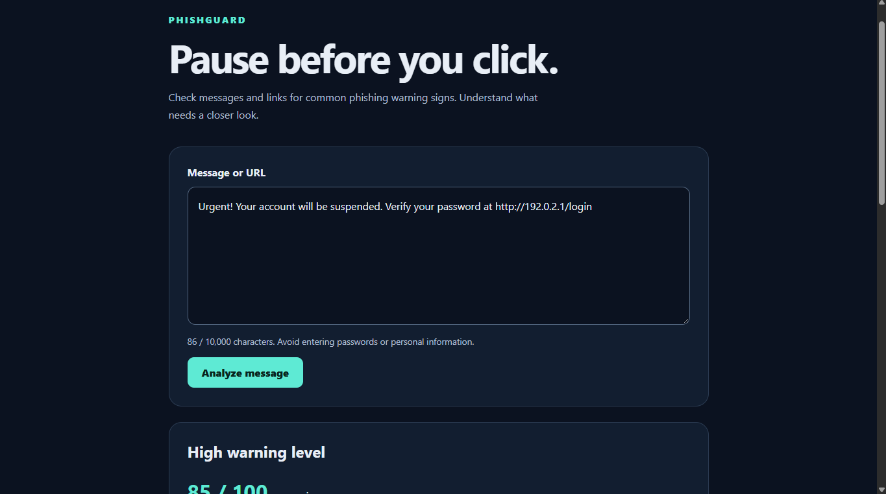

# PhishGuard 🛡️

**Pause before you click.**

PhishGuard checks messages and URLs for common phishing warning signs and explains what needs a closer look.

I built this as a cybersecurity student at FIU to practice identifying phishing indicators and turn those checks into a working web app. I wanted the results to explain the warning signs rather than just display a score.




## What it does

- Checks for urgency, account threats, credential requests, payment requests, and unexpected prize claims.
- Identifies HTTP links, known URL shorteners, IP-address destinations, misleading `@` links, and internationalized domain encodings.
- Flags URLs that cannot be parsed correctly.
- Displays a warning score from 0–100 with explanations and matched text.
- Counts each warning type once per analysis to avoid inflating scores from repeated phrases or links.
- Rejects blank input and messages longer than 10,000 characters.


## How scoring works

Each matched rule adds a fixed number of points. The total is capped at 100.

| Score | Warning level |
|---|---|
| 0–24 | Low |
| 25–59 | Medium |
| 60–100 | High |

For example, this message scores **85/100**:

> Urgent! Your account will be suspended. Verify your password at http://192.0.2.1/login

It matches urgency, an account threat, a credential request, an HTTP link, and an IP-address destination.

The score is a rule-based warning indicator, **not a probability that a message is phishing**.


## Built with

- **Frontend:** React, TypeScript, Vite, CSS
- **Backend:** Python, FastAPI, Pydantic, Uvicorn
- **Testing:** pytest and FastAPI TestClient
- **Code checks:** ESLint and TypeScript


## Run locally

Install Python and Node.js with npm first.

Clone the repository:

```powershell
git clone https://github.com/abtahac-hue/phishguard.git
cd phishguard
```


### Terminal 1: Python API

From the repository root:

```powershell
py -m venv backend\.venv
.\backend\.venv\Scripts\python.exe -m pip install -r backend\requirements.txt
.\backend\.venv\Scripts\python.exe -m uvicorn main:app --app-dir backend --reload
```

Keep this terminal running.

- Health check: http://127.0.0.1:8000/health
- Interactive API documentation: http://127.0.0.1:8000/docs


### Terminal 2: React website

Open a separate terminal in the repository root:

```powershell
cd frontend
npm ci
npm run dev
```

Open the Local URL printed by Vite. It usually starts at http://localhost:5173, but the port may change if it is already occupied.

The Vite development proxy forwards `/api` requests to the Python API.

These commands are for Windows PowerShell. On macOS or Linux, create the environment with `python3` and use `backend/.venv/bin/python` for the backend commands.


## Run the checks

Backend tests, from the repository root:

```powershell
.\backend\.venv\Scripts\python.exe -m pytest backend -q
```

Frontend checks, from the `frontend` folder:

```powershell
npm run lint
npm run build
```

The current backend includes nine tests covering message scoring, repeated indicators, input validation, and URL checks.


## Limitations

PhishGuard is an educational prototype. It can miss phishing attempts and flag legitimate messages.

- A low score does not guarantee safety.
- HTTPS does not guarantee a trustworthy website.
- Shortened links, IP addresses, and internationalized domains can be legitimate.
- Phrase matching does not understand context or negation.
- URL extraction currently recognizes links starting with `http://`, `https://`, or `www.`.
- Links are inspected as text. The app does not visit destinations, resolve redirects, or query threat databases.
- Avoid entering passwords, verification codes, or sensitive personal information.


## Project status

The app currently runs locally. A public demo has not been deployed.

The Vite proxy works during development; a production deployment also needs a hosted Python API and routing configured to reach it.


## Author

Built by **Abtaha Chowdhury**, a cybersecurity student at Florida International University.

## License

MIT — see [LICENSE](LICENSE).

Thank You!
